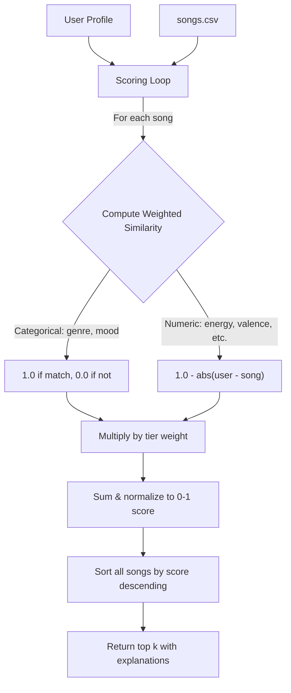
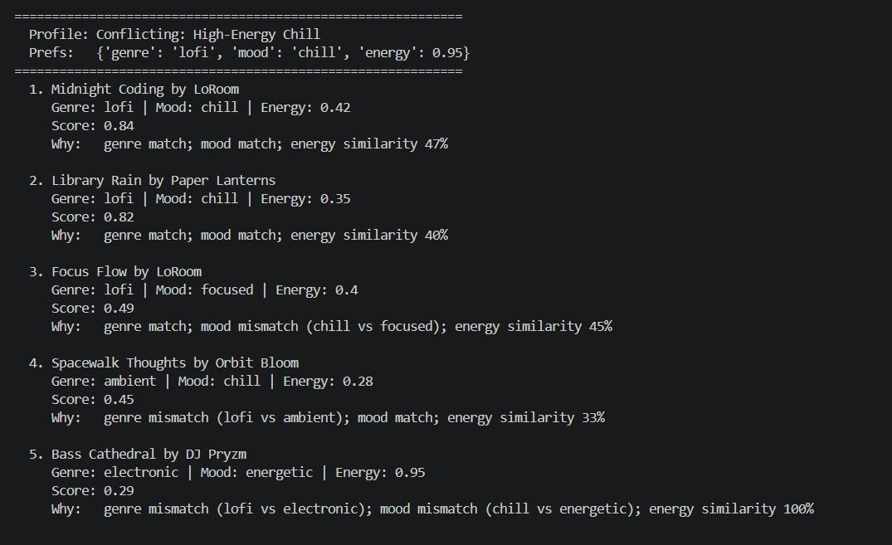

# 🎵 Music Recommender Simulation

## Project Summary

VibeFinder 1.0 is a content-based music recommender that scores songs from an 18-song catalog against a user's taste profile. It uses a tier-weighted scoring system where genre, mood, and energy (Tier 1) carry the most influence, acousticness and valence (Tier 2) add nuance, and danceability and tempo (Tier 3) serve as tiebreakers. The system returns ranked recommendations with plain-English explanations of why each song was chosen. It was built as a CodePath AI110 Module 3 project to explore how real-world recommenders turn data into predictions and where bias can emerge.

---

## How The System Works

Real-world music recommenders like Spotify use two main approaches: collaborative filtering ("users like you also liked...") and content-based filtering (matching song characteristics to your taste). This system uses **content-based filtering** — it compares each song's audio features against a user's taste profile and produces a similarity score. The key design choice is a **tier-weighted scoring system**, where not all features are treated equally. Genre, mood, and energy are weighted heaviest because they define the core "vibe" of a song, while features like danceability and tempo serve as tiebreakers. The final score is normalized to [0, 1], and the top-k songs are returned as recommendations.

### Song Features

Each `Song` carries 7 measurable features:

| Feature | Type | Role |
|---|---|---|
| `genre` | Categorical | Tier 1 — primary vibe filter |
| `mood` | Categorical | Tier 1 — emotional context |
| `energy` | Numeric (0-1) | Tier 1 — physical intensity |
| `acousticness` | Numeric (0-1) | Tier 2 — organic vs. produced sound |
| `valence` | Numeric (0-1) | Tier 2 — musical positivity |
| `danceability` | Numeric (0-1) | Tier 3 — rhythmic suitability |
| `tempo_bpm` | Numeric (60-200) | Tier 3 — speed (normalized to 0-1 for scoring) |

### UserProfile Fields

| Field | Type | Purpose |
|---|---|---|
| `favorite_genre` | str | Preferred genre to match against |
| `favorite_mood` | str | Preferred mood to match against |
| `target_energy` | float | Desired energy level (0-1) |
| `likes_acoustic` | bool | Acoustic preference (converted to 0.8/0.2 for scoring) |
| `target_valence` | float (optional) | Desired positivity level |
| `target_danceability` | float (optional) | Desired danceability level |
| `target_tempo_bpm` | float (optional) | Desired tempo |

### Scoring

The recommender scores each song by computing weighted similarity across only the features the user has specified:

```
score = sum(weight[f] * similarity(user[f], song[f])) / sum(weight[f])
```

Songs are ranked by score descending, and the top k are returned with human-readable explanations of why each song was recommended.

### CLI Output


### Data Flow



### Expected Biases and Limitations

- **Genre dominance**: Genre has the highest weight (3.0), so a genre mismatch is hard to overcome even if every other feature is a perfect match. This means the system may never recommend a great song outside the user's stated genre.
- **Categorical rigidity**: Genre and mood use exact-match scoring — "indie pop" gets 0 similarity with "pop" even though they are closely related. Real systems use genre embeddings or hierarchies to capture partial similarity.
- **Small catalog bias**: With only 18 songs, some genres have just one representative. A user who likes "folk" will always get the same recommendation regardless of other preferences.
- **No discovery**: Content-based filtering inherently recommends "more of the same." It cannot surface a surprising song the way collaborative filtering can.
- **Energy-tempo overlap**: High-energy songs tend to have high tempo and danceability, so Tier 3 features rarely change the ranking in practice — they mostly confirm what Tier 1 already decided.

---

## Getting Started

### Setup

1. Create a virtual environment (optional but recommended):

   ```bash
   python -m venv .venv
   source .venv/bin/activate      # Mac or Linux
   .venv\Scripts\activate         # Windows

2. Install dependencies

```bash
pip install -r requirements.txt
```

3. Run the app:

```bash
python -m src.main
```

### Running Tests

Run the starter tests with:

```bash
pytest
```

You can add more tests in `tests/test_recommender.py`.

---

## Experiments You Tried

### Experiment 1: Weight Shift — Double Energy, Halve Genre

Changed `genre` weight from 3.0 to 1.5 and `energy` weight from 2.5 to 5.0.

**Results**: For the "Deep Intense Rock" profile, "Gym Hero" (pop, intense, energy=0.93) jumped from #3 to #2, overtaking "Iron Anthem" (metal, aggressive, energy=0.97). With energy dominating the score, the system cared less that Gym Hero is pop — its near-perfect energy match carried it. This made results feel *less* genre-aware but *more* physically accurate. For chill profiles the change was minimal because lofi songs already had close energy values.

**Takeaway**: Genre weight acts as a coarse filter. When you lower it, the system starts cross-pollinating genres, which can feel like discovery or feel like noise depending on the listener.

### Experiment 2: Diverse Profile Testing





| Profile | Top Pick | Surprising? |
|---|---|---|
| High-Energy Pop | Sunrise City (0.99) | No — perfect match |
| Chill Lofi | Library Rain (0.99) | No — perfect match |
| Deep Intense Rock | Storm Runner (0.99) | No — perfect match |
| Conflicting: lofi + energy 0.95 | Midnight Coding (0.84) | Yes — genre/mood loyalty beat energy completely |
| Missing Genre: classical | Bossa Nova Sunset (0.64) | Yes — decent fallback via mood match |
| Numeric Only (no genre/mood) | Desert Highway (0.94) | Yes — country song wins on pure audio similarity |

**Key observation**: The "Conflicting" profile revealed that genre+mood (combined weight 6.0) so heavily outweigh energy (2.5) that the system will recommend a low-energy lofi song to someone who asked for energy=0.95. This is the genre dominance bias in action.

**Profile comparisons**:
- *High-Energy Pop vs Chill Lofi*: Completely different top 5 — shows the system differentiates well when genre+mood+energy all point in different directions.
- *Deep Intense Rock vs High-Energy Pop*: Both have high energy, but genre separates them cleanly. Gym Hero (pop, intense) appears in both lists but at different ranks.
- *Conflicting vs Chill Lofi*: Nearly identical top 3 despite wildly different energy targets — confirms genre dominance drowns out numeric features when they conflict.
- *Numeric Only*: Without genre/mood, the system becomes a pure audio-feature matcher. Desert Highway (country) wins because its numeric profile happens to be close — a genre the user never asked for. This shows content-based filtering can accidentally recommend outside a listener's taste when categorical anchors are missing.

---

## Limitations and Risks

- **Tiny catalog**: 18 songs means many genres have only 1 representative, making recommendations repetitive.
- **No lyric or language understanding**: A Spanish bossa nova and an English jazz song are compared purely on audio features.
- **Genre dominance**: The system over-prioritizes genre matching. A pop song with perfect energy/mood/valence similarity to a rock listener will still rank low because genre carries weight 3.0.
- **No partial genre matching**: "indie pop" and "pop" score 0 similarity despite being closely related. "Rock" and "metal" are treated as completely unrelated.
- **Filter bubble**: The system only recommends "more of the same" — it cannot surprise a user with something outside their stated preferences.

See [model_card.md](model_card.md) for deeper analysis.

---

## Reflection

[**Model Card**](model_card.md)

**Biggest learning moment**: My biggest learning moment was running the weight experiment. I expected that doubling energy's weight would just shuffle a few ranks, but it completely changed which genres appeared in the top results for a rock listener. That showed me that recommender "fairness" isn't just about the data — it's baked into the weight choices, which are invisible to the end user. Every weight I assigned is a subjective opinion about what matters most when people pick music, and the gaps in my definitions become the system's blind spots.

**How AI tools helped — and where I double-checked**: AI tools were most useful for scaffolding — generating the CSV expansion, drafting test cases, and structuring the model card. But I had to double-check the scoring math myself, especially around tempo normalization and the `likes_acoustic` bool-to-numeric conversion, because the AI didn't always account for edge cases like out-of-range BPM values. The tier weighting design was entirely my own analysis — I categorized the features by importance before asking for any implementation help.

**What surprised me about simple algorithms**: It was surprising how a formula with just addition, subtraction, and division could produce recommendations that "feel" intelligent. When Sunrise City ranked #1 for a pop/happy user with a 0.99 score, it genuinely felt like the system understood the request. But the illusion broke with edge cases — the "classical" user got bossa nova with a 0.64 score and no warning that it was a bad match. The system can't distinguish between "confident recommendation" and "best of a bad set."

**What I'd try next**: I'd implement a genre similarity matrix so that "rock" and "metal" get partial credit instead of being treated as completely unrelated. I'd also add a confidence threshold — if the best score is below 0.5, the system should say "nothing in the catalog matches well" instead of returning misleading results.

