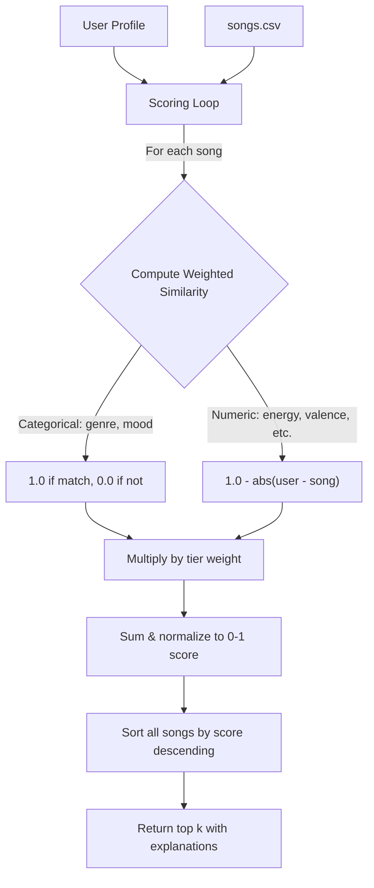

# 🎵 Music Recommender Simulation

## Personal Notes
Collaborative Filtering: if Song X and Song Y frequently appear in the same playlists, they're considered related.
  - "Users like you also liked..."
  - Strength: surprise factor, discovery of unrelated songs for a person.
  - Weakness: new listeners get zero recommendations; popular tracks may get favored.

Content-Based Filtering: songs with similar characteristics are recommended.
  - Strength: no listening history is required; just listen to one song and you get recommended something similar.
  - Weakness: only recommended more of the "same" songs.


Dataset Overview
  - Your songs.csv has 10 songs with 7 features split into two types:

  ┌──────────────┬───────────────┬─────────────────────────────────────────────────────────────────┬─────────────────┐
  │   Feature    │     Type      │                          Range in Data                          │ Example Spread  │
  ├──────────────┼───────────────┼─────────────────────────────────────────────────────────────────┼─────────────────┤
  │ genre        │ Categorical   │ 6 values (pop, lofi, rock, ambient, jazz, synthwave, indie pop) │ Discrete labels │
  ├──────────────┼───────────────┼─────────────────────────────────────────────────────────────────┼─────────────────┤
  │ mood         │ Categorical   │ 5 values (happy, chill, intense, relaxed, focused, moody)       │ Discrete labels │
  ├──────────────┼───────────────┼─────────────────────────────────────────────────────────────────┼─────────────────┤
  │ energy       │ Numeric (0-1) │ 0.28 – 0.93                                                     │ Wide spread     │
  ├──────────────┼───────────────┼─────────────────────────────────────────────────────────────────┼─────────────────┤
  │ tempo_bpm    │ Numeric       │ 60 – 152                                                        │ Wide spread     │
  ├──────────────┼───────────────┼─────────────────────────────────────────────────────────────────┼─────────────────┤
  │ valence      │ Numeric (0-1) │ 0.48 – 0.84                                                     │ Moderate spread │
  ├──────────────┼───────────────┼─────────────────────────────────────────────────────────────────┼─────────────────┤
  │ danceability │ Numeric (0-1) │ 0.41 – 0.88                                                     │ Moderate spread │
  ├──────────────┼───────────────┼─────────────────────────────────────────────────────────────────┼─────────────────┤
  │ acousticness │ Numeric (0-1) │ 0.05 – 0.92                                                     │ Wide spread     │
  └──────────────┴───────────────┴─────────────────────────────────────────────────────────────────┴─────────────────┘

  
Feature-by-Feature Assessment
  Tier 1: Strongest "Vibe" Indicators

  genre + mood — These are the most intuitive, human-readable filters. When someone says "I want chill lofi," they're already using these two features. They act as coarse-grained filters that immediately narrow 
  the field. In the dataset, the combination of genre+mood cleanly separates distinct listening contexts (study session vs. workout vs. driving).

  energy — This is arguably the single most powerful numeric feature. It cleanly separates "Spacewalk Thoughts" (0.28, ambient chill) from "Gym Hero" (0.93, intense pop). Energy maps directly to how music feels 
  physically — are you nodding off or bouncing? It also has the widest practical spread in the dataset.

  Tier 2: Strong Supporting Features

  acousticness — Has the widest numeric spread (0.05 to 0.92) and captures a real vibe divide: electronic/produced sounds vs. organic/intimate sounds. "Gym Hero" at 0.05 feels completely different from
  "Spacewalk Thoughts" at 0.92, even beyond energy. The UserProfile already has likes_acoustic as a boolean, which shows the project designers considered this important.

  valence — Measures musical positivity/happiness. "Sunrise City" (0.84) sounds uplifting; "Storm Runner" (0.48) sounds darker. This adds emotional nuance that mood alone can't capture — two "chill" songs can   
  have different emotional tones.

  Tier 3: Useful but Secondary

  danceability — Matters in specific contexts (party playlists) but overlaps heavily with energy. In this dataset, high-energy songs tend to be high-danceability too. It adds less unique information.

  tempo_bpm — Objectively measurable but less perceptually meaningful on its own. A 120 BPM pop song and a 120 BPM jazz song feel nothing alike. Tempo is also on a different scale (60-152) vs. the 0-1 features, 
  so it needs normalization. Useful as a tiebreaker, not a primary signal.


## Project Summary

In this project you will build and explain a small music recommender system.

Your goal is to:

- Represent songs and a user "taste profile" as data
- Design a scoring rule that turns that data into recommendations
- Evaluate what your system gets right and wrong
- Reflect on how this mirrors real world AI recommenders

Replace this paragraph with your own summary of what your version does.

---

## How The System Works

Real-world music recommenders like Spotify use two main approaches: collaborative filtering ("users like you also liked...") and content-based filtering (matching song characteristics to your taste). This system uses **content-based filtering** — it compares each song's audio features against a user's taste profile and produces a similarity score. The key design choice is a **tier-weighted scoring system**, where not all features are treated equally. Genre, mood, and energy are weighted heaviest because they define the core "vibe" of a song, while features like danceability and tempo serve as tiebreakers. The final score is normalized to [0, 1], and the top-k songs are returned as recommendations.

### Song Features

Each `Song` carries 7 measurable features:

| Feature | Type | Role |
|---|---|---|
| `genre` | Categorical | Tier 1 — primary vibe filter |
| `mood` | Categorical | Tier 1 — emotional context |
| `energy` | Numeric (0-1) | Tier 1 — physical intensity |
| `acousticness` | Numeric (0-1) | Tier 2 — organic vs. produced sound |
| `valence` | Numeric (0-1) | Tier 2 — musical positivity |
| `danceability` | Numeric (0-1) | Tier 3 — rhythmic suitability |
| `tempo_bpm` | Numeric (60-200) | Tier 3 — speed (normalized to 0-1 for scoring) |

### UserProfile Fields

| Field | Type | Purpose |
|---|---|---|
| `favorite_genre` | str | Preferred genre to match against |
| `favorite_mood` | str | Preferred mood to match against |
| `target_energy` | float | Desired energy level (0-1) |
| `likes_acoustic` | bool | Acoustic preference (converted to 0.8/0.2 for scoring) |
| `target_valence` | float (optional) | Desired positivity level |
| `target_danceability` | float (optional) | Desired danceability level |
| `target_tempo_bpm` | float (optional) | Desired tempo |

### Scoring

The recommender scores each song by computing weighted similarity across only the features the user has specified:

```
score = sum(weight[f] * similarity(user[f], song[f])) / sum(weight[f])
```

Songs are ranked by score descending, and the top k are returned with human-readable explanations of why each song was recommended.

### Data Flow



### Expected Biases and Limitations

- **Genre dominance**: Genre has the highest weight (3.0), so a genre mismatch is hard to overcome even if every other feature is a perfect match. This means the system may never recommend a great song outside the user's stated genre.
- **Categorical rigidity**: Genre and mood use exact-match scoring — "indie pop" gets 0 similarity with "pop" even though they are closely related. Real systems use genre embeddings or hierarchies to capture partial similarity.
- **Small catalog bias**: With only 18 songs, some genres have just one representative. A user who likes "folk" will always get the same recommendation regardless of other preferences.
- **No discovery**: Content-based filtering inherently recommends "more of the same." It cannot surface a surprising song the way collaborative filtering can.
- **Energy-tempo overlap**: High-energy songs tend to have high tempo and danceability, so Tier 3 features rarely change the ranking in practice — they mostly confirm what Tier 1 already decided.

---

## Getting Started

### Setup

1. Create a virtual environment (optional but recommended):

   ```bash
   python -m venv .venv
   source .venv/bin/activate      # Mac or Linux
   .venv\Scripts\activate         # Windows

2. Install dependencies

```bash
pip install -r requirements.txt
```

3. Run the app:

```bash
python -m src.main
```

### Running Tests

Run the starter tests with:

```bash
pytest
```

You can add more tests in `tests/test_recommender.py`.

---

## Experiments You Tried

Use this section to document the experiments you ran. For example:

- What happened when you changed the weight on genre from 2.0 to 0.5
- What happened when you added tempo or valence to the score
- How did your system behave for different types of users

---

## Limitations and Risks

Summarize some limitations of your recommender.

Examples:

- It only works on a tiny catalog
- It does not understand lyrics or language
- It might over favor one genre or mood

You will go deeper on this in your model card.

---

## Reflection

Read and complete `model_card.md`:

[**Model Card**](model_card.md)

Write 1 to 2 paragraphs here about what you learned:

- about how recommenders turn data into predictions
- about where bias or unfairness could show up in systems like this


---

## 7. `model_card_template.md`

Combines reflection and model card framing from the Module 3 guidance. :contentReference[oaicite:2]{index=2}  

```markdown
# 🎧 Model Card - Music Recommender Simulation

## 1. Model Name

Give your recommender a name, for example:

> VibeFinder 1.0

---

## 2. Intended Use

- What is this system trying to do
- Who is it for

Example:

> This model suggests 3 to 5 songs from a small catalog based on a user's preferred genre, mood, and energy level. It is for classroom exploration only, not for real users.

---

## 3. How It Works (Short Explanation)

Describe your scoring logic in plain language.

- What features of each song does it consider
- What information about the user does it use
- How does it turn those into a number

Try to avoid code in this section, treat it like an explanation to a non programmer.

---

## 4. Data

Describe your dataset.

- How many songs are in `data/songs.csv`
- Did you add or remove any songs
- What kinds of genres or moods are represented
- Whose taste does this data mostly reflect

---

## 5. Strengths

Where does your recommender work well

You can think about:
- Situations where the top results "felt right"
- Particular user profiles it served well
- Simplicity or transparency benefits

---

## 6. Limitations and Bias

Where does your recommender struggle

Some prompts:
- Does it ignore some genres or moods
- Does it treat all users as if they have the same taste shape
- Is it biased toward high energy or one genre by default
- How could this be unfair if used in a real product

---

## 7. Evaluation

How did you check your system

Examples:
- You tried multiple user profiles and wrote down whether the results matched your expectations
- You compared your simulation to what a real app like Spotify or YouTube tends to recommend
- You wrote tests for your scoring logic

You do not need a numeric metric, but if you used one, explain what it measures.

---

## 8. Future Work

If you had more time, how would you improve this recommender

Examples:

- Add support for multiple users and "group vibe" recommendations
- Balance diversity of songs instead of always picking the closest match
- Use more features, like tempo ranges or lyric themes

---

## 9. Personal Reflection

A few sentences about what you learned:

- What surprised you about how your system behaved
- How did building this change how you think about real music recommenders
- Where do you think human judgment still matters, even if the model seems "smart"

